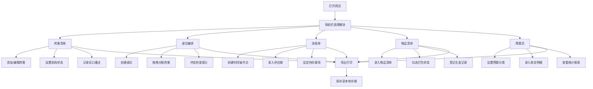

## 1. 产品概述
婚礼筹备协同管理系统，为筹备婚礼的新人和家人提供一站式的宾客、流程、物品、预算管理工具。纯前端设计，浏览器打开即可使用，适合多人轮流查看和补充信息。
- 解决婚礼筹备过程中信息分散、沟通低效、遗漏细节等痛点
- 目标用户：准新人及其家人、婚礼策划协助人员

## 2. 核心功能

### 2.1 用户角色
本系统为纯前端本地应用，无需注册登录，所有数据存储于浏览器本地存储。

| 角色 | 使用方式 | 核心权限 |
|------|----------|----------|
| 普通用户 | 直接打开浏览器访问 | 完整的增删改查、导出打印权限 |

### 2.2 功能模块
1. **宾客清单页**：嘉宾分组管理、到场状态记录、忌口与特殊需求备注、人数统计
2. **桌位编排页**：桌位可视化、宾客拖拽编排、同桌冲突提示、桌号与桌名管理
3. **流程单页**：仪式流程时间轴、供应商联系人整理、待办事项提醒
4. **物品清单页**：物品分类管理、打包勾选、礼金记录与统计
5. **预算页**：预算分类统计、收支记录、实时结余计算、导出打印

### 2.3 页面详情
| 页面名称 | 模块名称 | 功能描述 |
|-----------|-------------|---------------------|
| 宾客清单 | 嘉宾分组标签 | 按男方/女方/亲友/同事等分组筛选和管理 |
| 宾客清单 | 嘉宾列表 | 添加/编辑/删除嘉宾，记录姓名、电话、人数、关系 |
| 宾客清单 | 状态管理 | 标记邀请中/已确认/待定/无法出席状态 |
| 宾客清单 | 备注信息 | 记录忌口、特殊需求、坐席偏好等 |
| 宾客清单 | 统计面板 | 实时统计总人数、各状态人数、分组人数 |
| 桌位编排 | 桌位布局 | 圆形桌位可视化展示，显示桌号桌名与容纳人数 |
| 桌位编排 | 拖拽编排 | 将宾客从侧边列表拖拽到指定桌位 |
| 桌位编排 | 冲突提示 | 标记存在矛盾关系的宾客，同桌时高亮警告 |
| 桌位编排 | 桌位管理 | 添加/删除桌位、设置桌名、调整容纳人数 |
| 流程单 | 时间轴 | 按日期+时间展示婚礼当天及前后的流程节点 |
| 流程单 | 流程项管理 | 添加/编辑/删除流程项，设置时间、地点、负责人、备注 |
| 流程单 | 供应商联系人 | 分类管理摄影、化妆、司仪、酒店等联系人信息 |
| 流程单 | 待办提醒 | 婚礼前中后各阶段待办事项，支持完成勾选和优先级 |
| 物品清单 | 物品分类 | 按首饰/服装/证件/装饰/礼品等分类管理 |
| 物品清单 | 打包勾选 | 物品打包状态勾选，分类统计打包进度 |
| 物品清单 | 礼金记录 | 记录宾客礼金金额、到账方式、备注说明 |
| 物品清单 | 礼金统计 | 总金额统计、分类汇总图表展示 |
| 预算页 | 分类管理 | 按场地/餐饮/摄影/服装/化妆/花艺等分类设置预算 |
| 预算页 | 收支记录 | 添加预算支出和收入项，关联分类 |
| 预算页 | 统计面板 | 总预算/已支出/结余/各分类占比环形图展示 |
| 预算页 | 导出打印 | 所有页面支持打印和导出为PDF/Excel格式 |

## 3. 核心流程
用户打开网页后，默认展示宾客清单页，通过顶部导航切换各功能模块。所有数据自动保存至浏览器本地存储，刷新页面不丢失。主要用户流程包括：
- 添加宾客 → 记录信息 → 标记确认状态 → 拖拽分配桌位
- 创建流程节点 → 添加供应商 → 设定待办事项
- 登记物品清单 → 勾选打包状态 → 记录礼金
- 录入预算分类 → 记录支出 → 查看统计报表 → 导出打印

## 4. 用户界面设计

### 4.1 设计风格
- **主色调**：玫瑰粉 #F8B4B4 作为主色，搭配香槟金 #D4AF37 点缀
- **辅助色**：奶油白 #FFF8F5 背景色，深灰 #4A4A4A 文字色，薄荷绿 #A8D8B9 成功色
- **按钮风格**：圆角大按钮，柔和阴影，悬浮时有轻微上浮和颜色加深
- **字体**：标题使用"Noto Serif SC"衬线体（优雅庄重），正文使用"Noto Sans SC"无衬线体（清晰易读）
- **布局风格**：卡片式布局，顶部固定导航，内容区左右/上下分区
- **图标**：使用 lucide-react 线性图标，线条柔和

### 4.2 页面设计概述
| 页面名称 | 模块名称 | UI元素 |
|-----------|-------------|-------------|
| 所有页面 | 顶部导航 | 渐变色导航栏，5个Tab切换，当前页高亮，婚礼主题装饰元素 |
| 宾客清单 | 统计卡片 | 顶部4张统计卡片（总人数/确认/待定/缺席），渐变边框 |
| 宾客清单 | 嘉宾列表 | 分组Tab栏 + 卡片式嘉宾列表，支持展开详情，筛选搜索框 |
| 桌位编排 | 侧边宾客池 | 左侧可滚动未分配宾客列表，支持拖拽和搜索 |
| 桌位编排 | 桌位画布 | 右侧网格布局圆形桌位，拖拽落位，冲突时红色闪烁边框 |
| 流程单 | 时间轴 | 纵向时间轴，节点带日期时间徽章，左右交替展示 |
| 流程单 | 信息面板 | 左右两栏：供应商通讯录卡片 + 待办事项清单（优先级色块） |
| 物品清单 | 分类折叠面板 | 手风琴式分类面板，每项带勾选框和进度条 |
| 物品清单 | 礼金汇总 | 顶部大数字展示总礼金，下方分类卡片列表 |
| 预算页 | 统计仪表盘 | 顶部环形进度条+数字，下方分类进度条列表 |
| 预算页 | 明细表 | 可筛选的收支明细表格，支持排序 |

### 4.3 响应式
采用桌面端优先设计，宽度1200px以上为最佳体验；平板（768-1199px）自动调整为单列堆叠；手机端（<768px）抽屉式导航，内容全纵向排列，触摸优化的大按钮和列表项。

### 4.4 动画与交互
- 页面切换：淡入淡出过渡，150ms平滑
- 卡片悬浮：轻微上浮（translateY(-2px)）+ 阴影加深
- 拖拽过程：半透明跟随效果，落点高亮提示
- 勾选操作：打勾动画 + 背景色渐变过渡
- 数据统计：数字从0滚动到目标值的计数器动画
