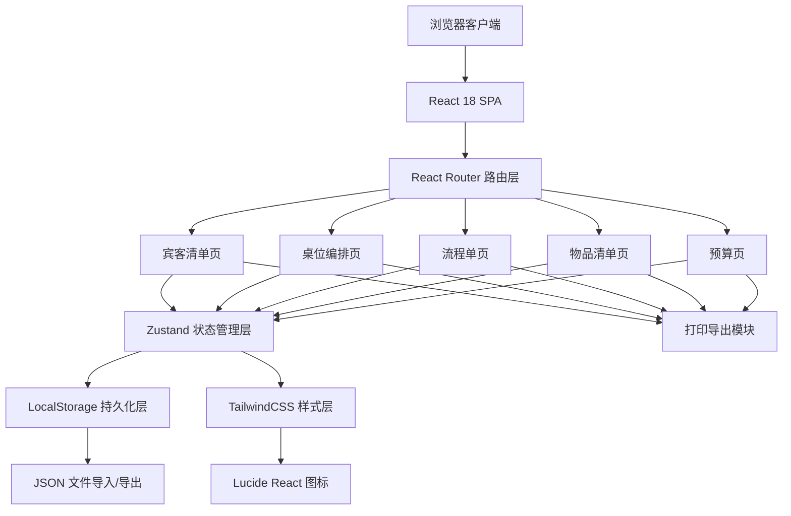
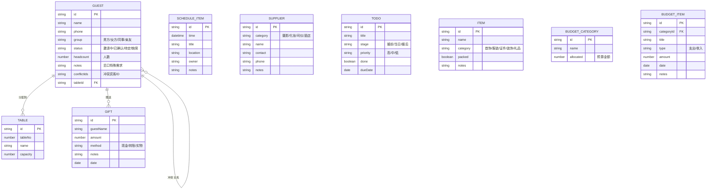

## 1. 架构设计



## 2. 技术描述
- **前端框架**：React@18 + TypeScript@5
- **构建工具**：Vite@5
- **路由管理**：react-router-dom@6
- **状态管理**：zustand@4（集中管理应用全局状态，含持久化中间件）
- **样式方案**：tailwindcss@3 + postcss + autoprefixer
- **图标库**：lucide-react@最新
- **拖拽方案**：原生HTML5 Drag & Drop API（无需额外依赖）
- **数据持久化**：浏览器 localStorage 自动保存 + JSON 文件导入导出备份
- **打印方案**：原生 window.print() + 专用打印样式 CSS

## 3. 路由定义
| Route | 页面用途 |
|-------|---------|
| / | 重定向至宾客清单页 |
| /guests | 宾客清单管理页 |
| /tables | 桌位编排页 |
| /schedule | 流程单与待办页 |
| /items | 物品清单与礼金页 |
| /budget | 预算管理与统计页 |

## 4. 数据模型

### 4.1 实体关系图



### 4.2 Zustand Store 类型定义

```typescript
// Guest 宾客
interface Guest {
  id: string;
  name: string;
  phone: string;
  group: 'groom' | 'bride' | 'colleague' | 'friend' | 'relative' | 'other';
  status: 'inviting' | 'confirmed' | 'pending' | 'absent';
  headcount: number;
  dietary: string;
  specialNeeds: string;
  seatPreference: string;
  conflictIds: string[];
  tableId: string | null;
}

// Table 桌位
interface Table {
  id: string;
  tableNo: number;
  name: string;
  capacity: number;
}

// Schedule 流程项
interface ScheduleItem {
  id: string;
  date: string;
  time: string;
  title: string;
  location: string;
  owner: string;
  notes: string;
}

// Supplier 供应商
interface Supplier {
  id: string;
  category: 'photo' | 'makeup' | 'mc' | 'hotel' | 'flower' | 'dress' | 'other';
  name: string;
  contact: string;
  phone: string;
  notes: string;
}

// Todo 待办
interface Todo {
  id: string;
  title: string;
  stage: 'before' | 'during' | 'after';
  priority: 'high' | 'medium' | 'low';
  done: boolean;
  dueDate: string;
}

// Item 物品
interface Item {
  id: string;
  name: string;
  category: 'jewelry' | 'clothing' | 'document' | 'decoration' | 'gift' | 'other';
  packed: boolean;
  quantity: number;
  notes: string;
}

// Gift 礼金
interface Gift {
  id: string;
  guestName: string;
  amount: number;
  method: 'cash' | 'transfer' | 'gift';
  notes: string;
  date: string;
}

// Budget 预算
interface BudgetCategory {
  id: string;
  name: string;
  allocated: number;
}

interface BudgetItem {
  id: string;
  categoryId: string;
  title: string;
  type: 'expense' | 'income';
  amount: number;
  date: string;
  notes: string;
}

interface WeddingState {
  // 数据
  guests: Guest[];
  tables: Table[];
  schedule: ScheduleItem[];
  suppliers: Supplier[];
  todos: Todo[];
  items: Item[];
  gifts: Gift[];
  budgetCategories: BudgetCategory[];
  budgetItems: BudgetItem[];
  
  // Actions - Guest
  addGuest: (g: Omit<Guest, 'id'>) => void;
  updateGuest: (id: string, patch: Partial<Guest>) => void;
  deleteGuest: (id: string) => void;
  assignGuestToTable: (guestId: string, tableId: string | null) => void;
  
  // Actions - Table
  addTable: (t: Omit<Table, 'id'>) => void;
  updateTable: (id: string, patch: Partial<Table>) => void;
  deleteTable: (id: string) => void;
  
  // Actions - Schedule
  addSchedule: (s: Omit<ScheduleItem, 'id'>) => void;
  updateSchedule: (id: string, patch: Partial<ScheduleItem>) => void;
  deleteSchedule: (id: string) => void;
  
  // Actions - Supplier
  addSupplier: (s: Omit<Supplier, 'id'>) => void;
  updateSupplier: (id: string, patch: Partial<Supplier>) => void;
  deleteSupplier: (id: string) => void;
  
  // Actions - Todo
  addTodo: (t: Omit<Todo, 'id'>) => void;
  updateTodo: (id: string, patch: Partial<Todo>) => void;
  deleteTodo: (id: string) => void;
  toggleTodo: (id: string) => void;
  
  // Actions - Item
  addItem: (i: Omit<Item, 'id'>) => void;
  updateItem: (id: string, patch: Partial<Item>) => void;
  deleteItem: (id: string) => void;
  toggleItemPacked: (id: string) => void;
  
  // Actions - Gift
  addGift: (g: Omit<Gift, 'id'>) => void;
  updateGift: (id: string, patch: Partial<Gift>) => void;
  deleteGift: (id: string) => void;
  
  // Actions - Budget
  addBudgetCategory: (c: Omit<BudgetCategory, 'id'>) => void;
  updateBudgetCategory: (id: string, patch: Partial<BudgetCategory>) => void;
  deleteBudgetCategory: (id: string) => void;
  addBudgetItem: (i: Omit<BudgetItem, 'id'>) => void;
  updateBudgetItem: (id: string, patch: Partial<BudgetItem>) => void;
  deleteBudgetItem: (id: string) => void;
  
  // 导入导出
  exportData: () => string;
  importData: (json: string) => void;
  resetAll: () => void;
}
```

## 5. 项目目录结构

```
d:\TraeProjects\1187\
├── src/
│   ├── components/          # 可复用组件
│   │   ├── Layout.tsx       # 顶部导航+主容器布局
│   │   ├── StatCard.tsx     # 统计卡片
│   │   ├── Modal.tsx        # 通用弹窗
│   │   ├── Button.tsx       # 按钮组件
│   │   ├── EmptyState.tsx   # 空状态提示
│   │   └── PrintButton.tsx  # 导出打印按钮
│   ├── pages/               # 页面组件
│   │   ├── Guests.tsx       # 宾客清单页
│   │   ├── Tables.tsx       # 桌位编排页
│   │   ├── Schedule.tsx     # 流程单页
│   │   ├── Items.tsx        # 物品清单页
│   │   └── Budget.tsx       # 预算页
│   ├── store/               # Zustand状态管理
│   │   └── useWeddingStore.ts
│   ├── hooks/               # 自定义hooks
│   │   └── useLocalStorage.ts
│   ├── utils/               # 工具函数
│   │   ├── id.ts            # UUID生成
│   │   ├── format.ts        # 金额/日期格式化
│   │   └── export.ts        # 打印导出
│   ├── types/               # TypeScript类型定义
│   │   └── index.ts
│   ├── data/                # Mock初始化数据
│   │   └── seed.ts
│   ├── App.tsx              # 路由配置
│   ├── main.tsx             # 入口文件
│   └── index.css            # 全局样式+Tailwind+打印样式
├── .trae/
│   └── documents/           # PRD与技术文档
├── index.html
├── vite.config.ts
├── tailwind.config.js
├── postcss.config.js
├── tsconfig.json
└── package.json
```
